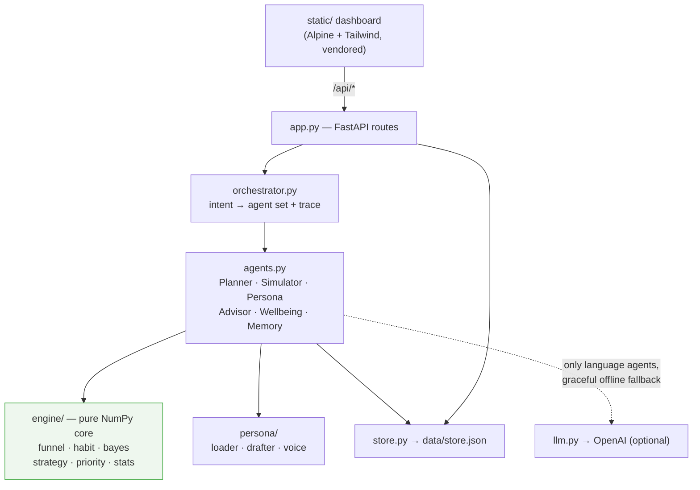

# Architecture

OSFL is a **functional core / imperative shell**. The math core (`osfl/engine/`) is
pure NumPy — no I/O, no clock, no randomness except an explicit seed — so it is
deterministic and tested without mocks. Everything stateful (HTTP, the JSON store,
the optional network call to OpenAI) lives in the thin shell around it.

## The two probabilities (read before "fixing" the engine)

A funnel goal reports a closed-form `P(≥target)` (deterministic point estimate) **and**
a Monte-Carlo `P(≥target)` (uncertainty-adjusted). The MC number sits *below* the closed
form on purpose — see [ADR 0001](docs/adr/0001-monte-carlo-below-closed-form.md).

## Layers

| Layer | Module(s) | Responsibility | I/O? |
|-------|-----------|----------------|------|
| Shell — HTTP | `app.py` | Routes, request/response models, `/healthz` | yes |
| Shell — routing | `orchestrator.py` | Map an intent to an ordered agent set; emit a trace | no |
| Domain | `agents.py` | Thin classes over engine + store + persona | via store |
| **Core** | `engine/` | Beta-Binomial MC, conjugate Bayes, priority math | **none** |
| Domain | `persona/` | Parse `personas/*.md`, deterministic + LLM drafting | reads files |
| Shell — state | `store.py` | One JSON file, atomic writes, reentrant lock | yes |
| Shell — model | `llm.py` | Optional OpenAI wrapper, timeout + graceful fallback | network |
| Types | `models.py` | Pydantic domain models + request DTOs (single source) | no |

## Request flow (logging an outcome)

`POST /api/goals/{id}/outcomes` → validate `OutcomeCreate` (422 on bad input) →
`Memory.log` runs the conjugate Bayesian update on the shot type's posterior →
`Simulator.run` re-forecasts → `DecisionAdvisor.advise` re-validates → the goal's
status flips to `at_risk` if it now misses its threshold. The response bundles the
new posterior, the fresh forecast, and the full dashboard state.
